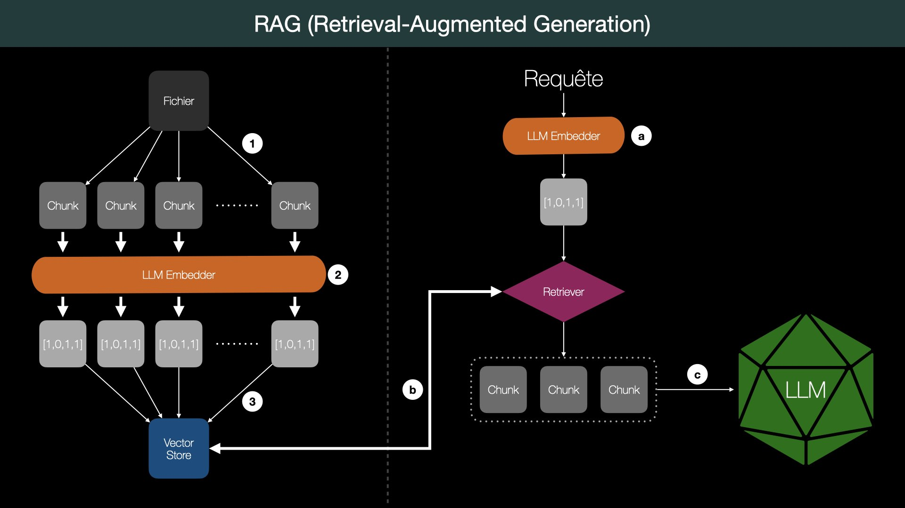

# RAG (Retrieval-Augmented Generation) - LangChain


Les systèmes **RAG (Retrieval-Augmented Generation)** dans LangChain permettent aux modèles de
langage de s'appuyer sur des **connaissances externes** pour produire des réponses plus précises,
actualisées et pertinentes.

Contrairement à un simple LLM qui génère une réponse uniquement à partir de ce qu'il a appris
pendant son entraînement, un système RAG interroge une base de documents pour retrouver des
morceaux d'information pertinents – appelés **chunks** – et les injecte dans le prompt du LLM.



**Que montre le schéma ci-dessus ?**

Le processus se divise en **deux grandes phases** : **préparation des documents** et **traitement
des requêtes**.

**Préparation des documents (à gauche)**

- (1) Un fichier (document source) est divisé en **chunks**, c'est-à-dire en petits segments
  de texte.
- (2) Chaque chunk est passé dans un LLM Embedder, un encodeur qui transforme le texte en un
  vecteur numérique (**embeddings**).
- (3) Ces vecteurs sont ensuite stockés dans un Vector Store, une base de données spécialisée
  pour les recherches par **similarité sémantique**.

**Traitement des requêtes (à droite)**

- (a) Lorsqu'un utilisateur emet une requête, celle-ci est à son tour encodée via
  **le même LLM Embedder** pour obtenir son vecteur.
- (b) Ce vecteur est utilisé par le **Retriever**, qui compare la requête aux vecteurs des
  **chunks** pour trouver les plus similaires.
- (c) Les chunks retrouvés sont envoyés au LLM, qui les utilise comme contexte pour formuler
  une réponse.

En résumé, ce fonctionnement est illustré par la boucle :

> Requête → Encodage → Recherche dans la base vectorielle → Récupération des chunks →
> Passage au LLM → Réponse contextuelle

## 1. Chargement du modèle LLM local

Dans cette section, nous chargeons un modèle de langage local grâce à **Ollama**. Cela permet
de travailler avec un **LLM directement sur notre machine**, sans connexion à une API externe.

Nous utilisons ici la classe `ChatOllama` de **LangChain**, qui nous permet d'interagir
facilement avec un modèle comme **llama3** ainsi qu'un **modèle d'embeddings** déjà téléchargés
via Ollama.

> **Import Chroma (LangChain v1)** : utiliser `from langchain_chroma import Chroma`
> (`pip install langchain-chroma`) à la place de l'ancien
> `from langchain_community.vectorstores import Chroma`.

## 2. RAG standard

Le **RAG standard** consiste à :

- formuler une requête explicite
- interroger une base de documents vectorisée
- utiliser un modèle LLM pour générer une réponse à partir des résultats retrouvés.

Ce pipeline est **efficace pour des questions indépendantes, sans contexte conversationnel**.

### 2.1 Préparation des documents

Nous initialisons les chemins nécessaires à la préparation des documents d'entrée.

### 2.2 Initialisation du vector store

Nous vérifions ici si la base vectorielle existe déjà.
Si ce n'est pas le cas, le fichier source est chargé, découpé en morceaux, enrichi de
métadonnées, puis indexé dans Chroma DB.

### 2.3 Initialisation du moteur de recherche vectorielle

Une fois la base vectorielle Chroma initialisée avec les embeddings, nous la transformons en
**moteur de recherche (retriever)**.
Cela permet de retrouver les documents les plus proches sémantiquement d'une question ou d'une
requête.

### 2.4 Exécution d'une requête de recherche

Le pipeline est composé de 4 étapes enchaînées avec l'opérateur `|` (LCEL) :

1. **Récupération** : `retriever | format_docs` cherche les chunks pertinents et les formate
   en texte brut.
2. **Prompt** : `ChatPromptTemplate` injecte le contexte documentaire et la question dans un
   template structuré.
3. **LLM** : le modèle génère une réponse à partir du prompt enrichi.
4. **Parser** : `StrOutputParser()` extrait le texte de la réponse (plus besoin de `.content`).

```python
rag_chain = (
    {"context": retriever | format_docs, "question": RunnablePassthrough()}
    | prompt
    | model
    | StrOutputParser()
)
```

### 🧩 Exercice

La société NovTech gère de nombreux documents internes :

- des rapports d'incidents (panne, erreur technique, post-mortem),
- des procédures opérationnelles (onboarding, accès système, déploiement…).

Actuellement, les équipes perdent du temps à chercher les bonnes informations à travers des
fichiers éparpillés.

Votre objectif est de construire un assistant basé sur l'architecture RAG qui permettra :

- de retrouver rapidement les procédures en cas de besoin,
- de consulter les résolutions d'incidents similaires,
- de répondre à des questions en langage naturel en s'appuyant uniquement sur les documents
  internes.

Pour vous aider, vous pouvez suivre les étapes suivantes :

1. Chargement des documents
2. Découpage en chunks
3. Indexation vectorielle
4. Recherche contextuelle
5. Génération de réponse

ℹ️ Les documents de l'entreprise se trouve dans le dossier `data/novtech`.
💪🏻 **Bonus** : Rendre possible un filtrage par catégorie dans les recherches

## 3. RAG conversationnel

Dans un cadre d'**interaction continue**, les utilisateurs posent souvent des questions
implicites ou référentielles (ex. "Et lui ?"). Le **RAG conversationnel** maintient un historique
de la conversation pour permettre ces questions de suivi.

**Approche LCEL avec historique explicite :**

On utilise un `MessagesPlaceholder` dans le prompt pour injecter `chat_history` (liste de
`HumanMessage` / `AIMessage`) à chaque tour. La liste est mise à jour manuellement après chaque
échange.

```python
prompt_conv = ChatPromptTemplate.from_messages([
    ("system", "..."),
    MessagesPlaceholder(variable_name="chat_history"),
    ("human", "Documents pertinents :\n\n{context}\n\nQuestion : {question}")
])

conversational_rag_chain = (
    {
        "context": lambda x: format_docs(retriever.invoke(x["question"])),
        "question": lambda x: x["question"],
        "chat_history": lambda x: x["chat_history"]
    }
    | prompt_conv
    | model
    | StrOutputParser()
)
```

> 💡 Pour une mémoire persistante multi-sessions (avec `MemorySaver` et `thread_id`),
> voir `langgraph.ipynb`.

### 🧩 Exercice

Repartez de l'exercice précédent (NovTech), et implémentez un assistant de conversation
continue avec la chaîne LCEL + `MessagesPlaceholder`.
